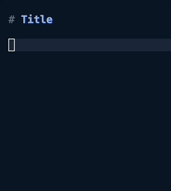

# company-spell
[](https://www.gnu.org/software/emacs/)
[](https://melpa.org/#/company-spell)



Emacs in buffer spellchecking that “just works”!

An Emacs `company-mode` backend for any terminal spellchecker. Unlike `company-ispell` which asks for a plaintext dictionary to be specified for ispell, `company-spell` directly uses your spellcheck program with no questions asked, and is compatible with ispell, aspell, and hunspell. I have not discovered any notable performance issues with this approach. aspell is the default because I find that it returns the best results.

It will automatically run on any buffer that has a major mode derived from `text-mode`, which includes almost all modes meant for human writing.

## Instructions

### Preparation

Ensure a terminal spellchecker is installed (`aspell`, `hunspell`, `ispell`, etc) and that you have access to [MELPA](https://melpa.org/#/getting-started).

### Installation

#### package-install

```elisp
M-x package-install company-spell
(push 'company-spell company-backends)
```

#### use-package

```elisp
(use-package company-spell
  :config (push 'company-spell company-backends)
  :ensure t)
```

### Configuration

Optionally, set a spellchecker that isn't the default value of `aspell`:
```elisp
(setf company-spell-command "hunspell")
;; or
(setf company-spell-command "ispell")
```

You can further customize your results by setting custom args (only `-a` is enabled by default). For instance, search via "soundslike":
```elisp
(setf company-spell-args "-a soundslike")
```
